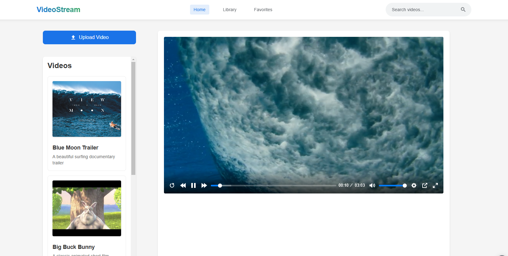

# VideoStream App

A modern video streaming application built with Meteor and React that allows users to upload, manage, and watch videos in real-time. The app features a clean, responsive interface and supports various video formats.

## Features

### Video Management
- 📤 Upload videos through drag-and-drop or file selection
- 🎥 Support for multiple video formats
- 🖼️ Automatic thumbnail generation
- 🗑️ Easy video deletion with confirmation dialog
- 📝 Add titles and descriptions to videos

### Video Player
- ▶️ Modern video player with custom controls
- 🔄 Real-time playback synchronization
- ⏭️ Skip forward/backward
- 🔊 Volume control
- ⚡ Smooth streaming experience

### User Interface
- 🎨 Clean, modern design
- 📱 Fully responsive layout
- 🌓 Intuitive navigation
- 🔍 Search functionality
- 💫 Smooth animations and transitions

### Technical Features
- ⚡ Real-time updates using Meteor's DDP
- 🔄 Automatic video state synchronization
- 📁 Efficient file handling and storage
- 🛡️ Error handling and validation
- 🚀 Optimized performance

## Main Components

### VideoPlayer
- Custom video player with controls
- Real-time state synchronization
- Progress tracking

### VideoList
- Displays available videos
- Thumbnail previews
- Delete functionality
- Active video highlighting

### VideoUpload
- Drag and drop support
- Progress indication
- File validation
- Error handling

### AppHeader
- Navigation
- Search functionality
- Modern design

## Technologies Used

- **Frontend**: React, CSS3
- **Backend**: Meteor, Node.js
- **Database**: MongoDB
- **Video Player**: Plyr
- **File Handling**: Node fs
- **Real-time Updates**: DDP Protocol

## Development

### Prerequisites
- Node.js (v14 or later)
- Meteor (v2.0 or later)
- MongoDB
